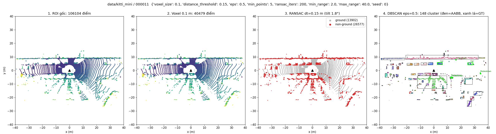
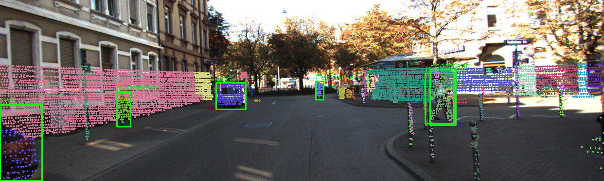
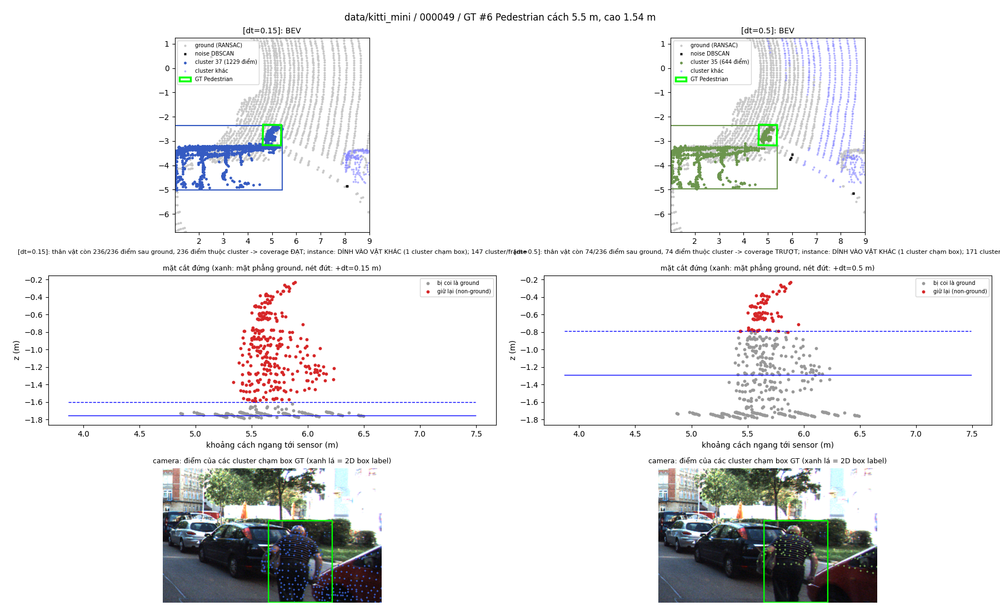
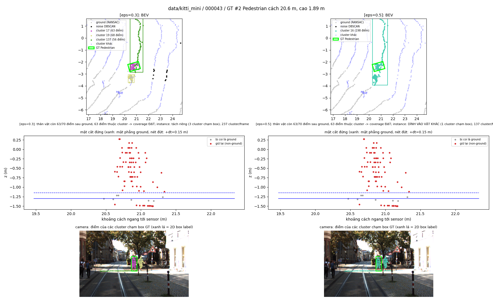
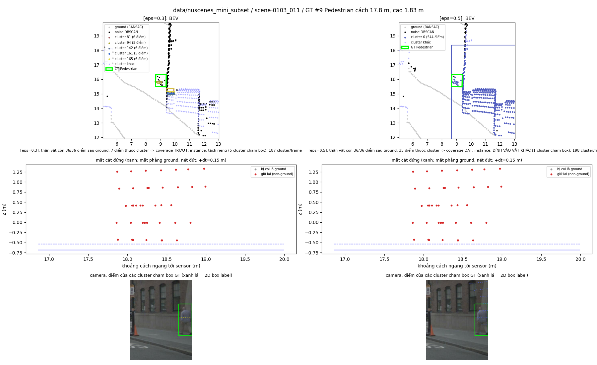

# Báo cáo Day 6: Phát hiện vật cản từ LiDAR không dùng deep learning (voxel → RANSAC → DBSCAN)

- **Họ tên:** Phạm Minh Hiếu
- **MSSV:** 2A202602630
- **Lớp:** AI20K – Track 4 (Computer Vision and Robotics)
- **Link repo:** https://github.com/hieulovecat/PhamMinhHieu-2A202602630--Track4-Day21
- **Topic:** D — Robot/drone obstacle
- **Dataset:** data/kitti_mini (thí nghiệm chính, 64 beam), data/nuscenes_mini_subset (so sánh 32 beam), data/synthetic (test phép chiếu)
- **Các frame đã dùng:** toàn bộ 20 frame kitti_mini (000001 … 000061), toàn bộ 80 keyframe nuScenes (scene-0103_000 … scene-1094_039). Demo: 000011, scene-1094_020. Failure: 000049, 000043, scene-0103_011

## 1. Claim

Trên 20 frame KITTI (86 object: 65 Car, 18 Pedestrian, 3 Cyclist trong bán kính 40 m), pipeline voxel 0.1 m → RANSAC ground → DBSCAN eps 0.5 m với `distance_threshold` ≤ 0.15 m **phủ được 100% object** (≥ 50% điểm thân vật nằm trong một cluster). **Tăng `distance_threshold` lên 0.5 m làm coverage tụt còn 40% Car và 72% Pedestrian.** Lý do: RANSAC chọn mặt phẳng chứa nhiều điểm nhất trong lớp dày 1 m, nên mặt phẳng bị đẩy lên. Độ cao cắt thực tế có trung vị là 0.77 m, lớn nhất 1.20 m, chứ không phải 0.5 m.

*Claim nháp ở CP1 bị bác bỏ một phần:* ở dt = 0.3 m, coverage của Pedestrian vẫn là 100%, chỉ mất 16% điểm thân vật. Ngưỡng gây hại thật sự nằm trong khoảng 0.3–0.5 m.

## 2. Evidence

**Demo** (`python -m src.obstacle_pipeline --data-root data/kitti_mini --frame 000011`): 4 bước BEV (ROI → voxel → ground/non-ground → cluster + AABB + GT), cluster chiếu lên camera, và BEV occupancy grid.




**Metric** (code: `src/obstacle_pipeline.py::evaluate`). Mỗi lần chỉ đổi **1 tham số**, các tham số còn lại giữ baseline `voxel 0.1, dt 0.15, eps 0.5, min_points 5, ROI 2–40 m, seed 0`.
- **coverage:** ≥ 50% điểm thân vật (cao hơn đáy box 0.1 m) nằm trong một cluster bất kỳ. Đây là metric theo góc nhìn tránh vật cản.
- **recall:** có cluster mà ≥ 50% điểm của cluster nằm trong box GT. Metric này đo khả năng tách riêng từng instance.
- **retention:** tỉ lệ điểm thân vật còn lại sau khi tách mặt đất.

**Sweep `distance_threshold` trên KITTI** (`results/obstacle_sweep_kitti.csv`, `results/plane_offset_kitti.csv`, [biểu đồ](../results/figures/sweep_distance_threshold_kitti.png)):

| dt (m) | coverage Car | coverage Ped | retention Car / Ped | recall (instance) | cluster/frame | độ cao cắt thực tế, trung vị (max) |
|---|---|---|---|---|---|---|
| 0.05 | 1.00 | 1.00 | 0.99 / 0.99 | 0.63 | 206 | 0.05 m (0.05) |
| 0.10 | 1.00 | 1.00 | 0.97 / 0.98 | 0.79 | 193 | 0.11 m (0.21) |
| **0.15** | **1.00** | **1.00** | 0.97 / 0.97 | 0.85 | 177 | 0.17 m (0.26) |
| 0.20 | 0.97 | 1.00 | 0.91 / 0.93 | 0.83 | 167 | 0.27 m (0.74) |
| 0.30 | 0.91 | 1.00 | 0.83 / 0.84 | 0.93 | 150 | 0.41 m (0.84) |
| 0.50 | **0.40** | **0.72** | 0.51 / 0.60 | 0.88 | 142 | **0.77 m (1.20)** |

**Sweep `voxel_size` và `eps` trên KITTI.** Latency đo trên frame 000011 (108k điểm): 20 vòng xen kẽ mọi cấu hình, bỏ vòng warm-up. Máy đo là Intel i7-8665U (laptop, 4C/8T), RAM 16 GB, Python 3.11, Open3D 0.20, file `results/latency_kitti.csv`.

| cấu hình | coverage all | recall all | số object bị dính vào vật khác | cluster/frame | p50 / p95 (ms) |
|---|---|---|---|---|---|
| voxel 0.05 | 1.00 | 0.85 | 13 | 184 | 595 / 797 |
| voxel 0.1 (baseline) | 1.00 | 0.85 | 13 | 177 | 300–347 / 396–527 |
| voxel 0.2 | 0.99 | 0.85 | 13 | 167 | 184 / 342 |
| voxel 0.4 | 0.90 | 0.96 | 2 | 161 | 134 / 198 |
| eps 0.3 | 0.98 | 0.99 | 1 | 338 | 286 / 362 |
| eps 0.8 | 1.00 | 0.74 | 22 | 102 | 356 / 768 |
| eps 1.2 | 1.00 | 0.63 | 32 | 61 | 491 / 729 |

**So sánh hai dataset** (`results/obstacle_sweep_nusc.csv`, 80 frame, 295 object, [biểu đồ eps](../results/figures/sweep_eps_nusc.png)):

| | coverage all (eps 0.3 / 0.5 / 0.8) | coverage Ped ở dt 0.5 | latency p50 baseline |
|---|---|---|---|
| KITTI 64 beam, ~108k điểm | 0.98 / 1.00 / 1.00 | 0.72 | ~300 ms |
| nuScenes 32 beam, ~35k điểm | **0.38** / 0.84 / 0.97 | 0.84 | 106 ms |

Nhận xét chính:
- **dt nhỏ không làm mất vật nhưng làm vật dính nhau.** Với dt = 0.05, mặt đường còn sót lại sẽ nối các vật với nhau (32 object bị dính, recall chỉ 0.63). Với dt lớn thì mất phần thấp của vật.
- **eps chuyển đổi giữa "tách được từng vật" và "phủ được vùng chiếm chỗ".** eps lớn làm giảm recall nhưng không làm giảm coverage.
- **Sang nuScenes, eps tối ưu tăng lên.** Lý do: ở 18 m, các tia LiDAR 32 beam (độ phân giải đứng 1.33°) cách nhau khoảng 0.42 m, lớn hơn eps = 0.3. KITTI 64 beam (khoảng 0.4°) chỉ cách nhau khoảng 0.13 m. nuScenes chạy nhanh hơn khoảng 3 lần vì có ít điểm hơn khoảng 3 lần.
- **Chạy lại cho cùng kết quả.** Các metric độ chính xác giống hệt nhau giữa các lần chạy, vì RANSAC tự viết dùng seed cố định (xem mục 3). Chỉ latency dao động khoảng ±15% do máy đang chạy việc khác. precision_fov của KITTI chỉ khoảng 0.11–0.16, nhưng đây là cận dưới, vì KITTI không gán nhãn tường, cột, cây (xem ảnh camera: các cluster màu hồng và xanh ngọc là tường và cột).

## 3. Failure case



**fail_01. Lớp Preprocess, kèm Geometry: dt = 0.5 "cắt" mất người đang cúi** (KITTI 000049, Pedestrian cao 1.54 m, cách 5.5 m).
- **Hiện tượng:** với dt = 0.15, mặt phẳng nằm ở z ≈ −1.75 m và người còn đủ 236/236 điểm. Với dt = 0.5, RANSAC chọn lớp dày 1 m chứa cả gầm xe và chân tường, nên mặt phẳng dịch lên z ≈ −1.29 m. Mọi điểm thấp hơn khoảng 0.96 m so với mặt đường thật bị coi là ground, người chỉ còn 74/236 điểm.
- **Không chỉ xảy ra ở frame này:** 19/20 frame có mặt phẳng dịch lên hơn 10 cm khi dt = 0.5 (`plane_offset_kitti.csv`).
- **Cách phát hiện khi chạy thật:** theo dõi độ cao mặt phẳng tại sensor, cảnh báo khi lệch quá 0.1 m so với độ cao lắp đặt (KITTI là 1.73 m). Theo dõi thêm độ nghiêng của mặt phẳng và `ground_ratio`.



**fail_02. Lớp Geometry, kèm Metric: mặt đường không phẳng nối 2 người thành 1 cluster** (KITTI 000043, 2 người đứng cách nhau khoảng 1 m, ở 20.6 m).
- **Nguyên nhân:** pipeline giả định cả vùng 40 m là một mặt phẳng duy nhất. Ở 21 m, mặt đường thấp hơn mặt phẳng ước lượng khoảng 0.2 m, nên một dải điểm mặt đường bị giữ lại như vật cản. Với eps = 0.5, dải này nối hai người vào một cluster (198 điểm). eps = 0.3 thì tách được.
- **Về mặt metric:** recall theo instance tính ca này là "miss", nhưng coverage vẫn đạt. Với robot chỉ cần tránh vùng bị chiếm thì đây không phải lỗi an toàn. Với bài toán tracking hoặc đếm người thì đây là lỗi.
- **Cách khắc phục:** test một phía, tức coi mọi điểm có `z < plane + dt` là ground. Hoặc tách ground theo từng ô lưới, kiểu Patchwork.



**fail_03. Lớp Preprocess, tham số không khớp với sensor: eps = 0.3 biến người đi bộ thành nhiễu** (nuScenes scene-0103_011, cách 17.8 m).
- **Hiện tượng:** mặt cắt đứng cho thấy điểm trên người nằm thành 5 tầng, các tầng cách nhau khoảng 0.42 m. Khoảng cách này lớn hơn eps, nên mỗi tầng chỉ có 5–7 điểm và chỉ 7/36 điểm được đưa vào cluster. Kết quả là coverage của Pedestrian trên nuScenes rơi xuống 0.39.
- **Cách khắc phục:** cho eps thay đổi theo khoảng cách, với `eps(r) ≥ r·tan(Δθ_vertical)`. Đồng thời ghi log tỉ lệ điểm bị DBSCAN coi là nhiễu theo từng dải khoảng cách.

## 4. Khuyến nghị nếu triển khai thật

**Use-case:** robot AMR trong kho, chạy ≤ 2 m/s, cần thấy pallet thấp (khoảng 0.15 m), người ngồi và xe đẩy.

- **Tham số:** dùng `distance_threshold` 0.10–0.15 m kèm test một phía. Không dùng dt ≥ 0.3, vì nó cắt mất 0.4–1.2 m phần thấp của vật. Dùng eps 0.5 cho LiDAR 64 beam. Với LiDAR 32 beam, dùng eps 0.8 hoặc eps thay đổi theo khoảng cách.
- **Đánh đổi voxel:** voxel 0.2 nhanh gấp khoảng 1.7 lần so với 0.1 mà coverage vẫn 0.99. voxel 0.4 nhanh hơn nữa, nhưng mất vật mảnh (coverage 0.90).
- **Đánh đổi eps:** eps lớn cho ít cluster hơn và an toàn hơn cho việc tránh vật cản. Nhưng các vật sẽ dính nhau, nên không dùng được cho tracking hoặc phân loại.
- **Tốc độ:** trên i7-8665U, p50 vẫn khoảng 184 ms với voxel 0.2. Thời gian chủ yếu nằm ở RANSAC numpy (khoảng 125 ms). Để đạt 10 Hz, cần chuyển sang C++, giảm số vòng lặp khi dùng mặt phẳng của frame trước làm prior, hoặc thu hẹp ROI.
- **Chỉ số cần ghi log mỗi frame:**
  - độ cao và độ nghiêng của mặt phẳng ground so với giá trị lắp đặt;
  - `ground_ratio`, số điểm sau khi crop ROI;
  - số cluster và tỉ lệ điểm nhiễu theo dải khoảng cách;
  - khoảng cách tới vật cản gần nhất;
  - latency p95 của từng bước.

  Bất kỳ chỉ số nào nhảy đột ngột là dấu hiệu tách ground hoặc phân cụm đang sai.

## 5. Cách chạy lại

Toàn bộ lệnh chạy từ gốc repo. Cần Python ≥ 3.10.

```bash
pip install -r requirements.txt
pip install "open3d>=0.18"
python -m starter.projection --data-root data/synthetic --frame 000000
python -m starter.projection --data-root data/kitti_mini --frame 000011
python -m src.obstacle_pipeline --data-root data/kitti_mini --frame 000011
python -m src.obstacle_pipeline --data-root data/nuscenes_mini_subset --frame scene-1094_020
python -m src.sweep --data-root data/kitti_mini --tag kitti --latency-frame 000011
python -m src.sweep --data-root data/nuscenes_mini_subset --tag nusc --sweeps baseline distance_threshold eps --latency-frame scene-0103_010
python -m src.plane_offset --data-root data/kitti_mini --out results/plane_offset_kitti.csv
python -m src.failure --frame 000049 --gt 6 --a dt=0.15 --b dt=0.5 --zoom 4 --name fail_01_dt05_cuts_low_pedestrian
python -m src.failure --frame 000043 --gt 2 --a eps=0.3 --b eps=0.5 --zoom 4 --name fail_02_eps05_merges_two_pedestrians
python -m src.failure --data-root data/nuscenes_mini_subset --frame scene-0103_011 --gt 9 --a eps=0.3 --b eps=0.5 --zoom 4 --name fail_03_nusc32beam_eps03_pedestrian_as_noise
```

- Hai lệnh `src.sweep` mất khoảng 4–5 phút mỗi lệnh. Các metric độ chính xác lặp lại y hệt; latency phụ thuộc máy.
- Mọi script đều có `--help`.
- Các tool dùng lại được cho bài sau: `src/obstacle_pipeline.py` (pipeline + đánh giá so với GT), `src/sweep.py` (sweep tham số), `src/failure.py` (ảnh so sánh 2 cấu hình trên một object), `src/plane_offset.py` (kiểm tra mặt phẳng ground bị dịch).

## 6. Khai báo sử dụng AI

| Công cụ | Dùng cho việc gì | Bạn đã kiểm chứng thế nào |
|---|---|---|
| Claude Code (Claude Opus 5.5) | Viết 2 hàm TODO trong `starter/projection.py` | Test tay điểm (10, 0, 0) ra z_cam = 9.73 và pixel (614, 175), đúng như CP2. Điểm NaN và điểm sau camera bị loại. Xem ảnh overlay 3 dataset: điểm khớp lên xe và người, không có điểm trên trời |
| Claude Code | Viết toàn bộ code trong `src/`: pipeline, đánh giá so với GT, sweep, latency, ảnh failure | Chạy lại các cấu hình giống nhau và so CSV. Nhờ đó phát hiện `segment_plane` của Open3D không lặp lại được ở frame 000016, nên đã thay bằng RANSAC numpy có seed. Kiểm tra box GT vẽ trên BEV và camera khớp với điểm. Kiểm tra bằng mắt từng ảnh failure |
| Claude Code | Phân tích số liệu và viết nháp REPORT | Mọi con số trong báo cáo được copy từ CSV hoặc log trong `results/`, không tự bịa số. Claim nháp CP1 được giữ lại và ghi rõ là bị bác bỏ một phần |
